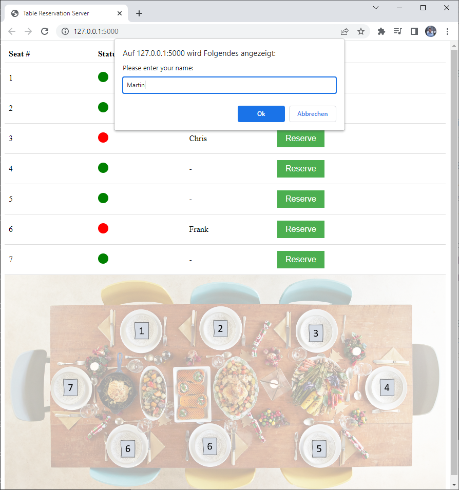

# Seat Reservation Server

## Overview

## Set-up
You need to pull this repo.
Also, need to install python (e.g. a virtual environment within the root folder of this repo) and then install the requirements like this:
`pip install -r requirements.txt`

## Idea
This server lets users select a seat number from a table. You may add any number of seats and just exchange the table image to your liking.
Once a seat is reserved, it's blocked for other users. Also, a csv file is saved on the server that saves the status of the reservation of each seat, along with the given name.

## Usage
This is a flask website. You can run a local server to test and adapt it to your liking. 
Once you're happy with your result, you can put this server online. As easy, fast and cheap method, I like to use pythonanywhere.
Please keep in mind that there is no security measure implemented. If you run an informal (internal) server, this might be enough, but be careful when you handle sensitive data. I'm taking no responsibility for that.

## Author
Martin Paridon

## License
MIT License, see LICENSE.MD

## Acknowledgments
ChatGPT was an immense help setting this up.
